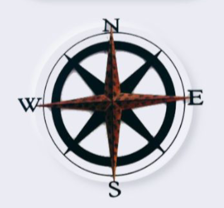
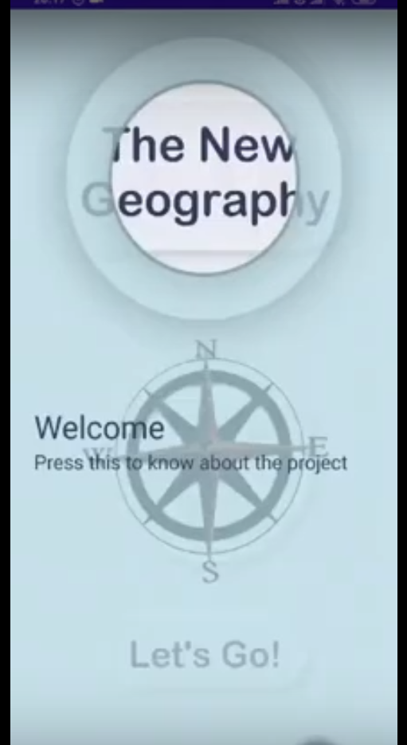

# The New Geography

<a name="readme-top"></a>


<!-- PROJECT SHIELDS -->
<!--
*** I'm using markdown "reference style" links for readability.
*** Reference links are enclosed in brackets [ ] instead of parentheses ( ).
*** See the bottom of this document for the declaration of the reference variables
*** for contributors-url, forks-url, etc. This is an optional, concise syntax you may use.
*** https://www.markdownguide.org/basic-syntax/#reference-style-links
-->
[![Contributors][contributors-shield]][contributors-url]
[![Forks][forks-shield]][forks-url]
[![Stargazers][stars-shield]][stars-url]
[![Issues][issues-shield]][issues-url]
[![MIT License][license-shield]][license-url]
[![LinkedIn][linkedin-shield]][linkedin-url]


<!-- PROJECT LOGO -->
<br />
<div align="center">
  <a href="https://github.com/aarav22/The-New-Geography">
    
  </a>

<h3 align="center">The New Geography</h3>

  <p align="center">
    The New Geography app aims to make users
aware of the various restrictions put on the
internet, in this case, Maps. This project is
made under the theme of Control in The New
Geography course, offered by Professor
Debayan Gupta, Ashoka University.
The app has sections such as ‘China’, ‘South
Korea’, ‘Others’ and, ‘Bonus’. The sections
represent various restrictions that have been
put on Google Maps, where they do not allow
certain places to be seen/accessible on the
Maps
    <br />
    <a href="https://github.com/aarav22/The-New-Geography"><strong>Explore the docs »</strong></a>
    <br />
    <br />
    <!-- <a href="https://github.com/aarav22/The-New-Geography">View Demo</a> -->
    ·     .
    <a href="https://github.com/aarav22/The-New-Geography/issues">Report Bug</a>
    ·
    <a href="https://github.com/aarav22/The-New-Geography/issues">Request Feature</a>
  </p>
</div>


<!-- TABLE OF CONTENTS -->
<details>
  <summary>Table of Contents</summary>
  <ol>
    <li>
      <a href="#about-the-project">About The Project</a>
      <ul>
        <li><a href="#built-with">Built With</a></li>
      </ul>
    </li>
    <li>
      <a href="#getting-started">Getting Started</a>
      <ul>
        <li><a href="#prerequisites">Prerequisites</a></li>
        <li><a href="#installation">Installation</a></li>
      </ul>
    </li>
    <li><a href="#usage">Usage</a></li>
    <li><a href="#contributing">Contributing</a></li>
    <li><a href="#license">License</a></li>
  </ol>
</details>


<!-- ABOUT THE PROJECT -->
## About The Project



In ‘China’, there are two options, you can
choose to know about the problem(restriction), which leads you to the
map of China, where Tiananmen Square is
already loaded on the maps. Now, you’ll see
a red marker on the location, but if you long press on the map, you can enable the
satellite view and observe that the location in fact isn’t there. The reason as to why this happens is because the Chinese Government mandates everyone to use its own geodetic datum GCJ-02 instead of the standard WGS-84.

In the solution, a conversion between the two datums has been implemented from the leaked code, multiple sources have been used to uncover the final code and then used to find the exact point on Google Maps.


### Architecture
The app is built in Kotlin but uses some scripts in Java for conversion between different datums. The app also uses Maps API from Google to load maps, switch to satelite views and search for locations.

[](https://youtube.com/clip/UgkxCQOL-pTbvHHkK0OouOwofi9r9xpg1F2n)

<p align="right">(<a href="#readme-top">back to top</a>)</p>


### Built With

* ![Android Studio][Android Studio]
* ![Kotlin][Kotlin]
* [![GCP][GCP]][GCP-url]

<p align="right">(<a href="#readme-top">back to top</a>)</p>


<!-- GETTING STARTED -->
## Getting Started

To get a local copy up and running follow these simple example steps.

### Prerequisites

* Android Studio

### Installation

1. Set up a billing account on GCP
2. Clone the repo
   ```sh
   git clone https://github.com/aarav22/The-New-Geography.git
   ```
3. Initialize the app in Android Studio
4. Enter your API Keys in `.env`

<p align="right">(<a href="#readme-top">back to top</a>)</p>


<!-- USAGE EXAMPLES -->
## Presentation
<!-- [![product shot 1][product-shot-1]](#) -->
- [Link](https://docs.google.com/presentation/d/1RTJTDM3qjqoZs6p_dANfB_E0AODI_I9EEnoH7kHyZBA/edit#slide=id.g905f56284a_1_25)
- [Report](https://raw.githubusercontent.com/aarav22/The-New-Geography/master/The%20New%20Geography%20App.pdf)
<!-- [![product shot 3][product-shot-3]](#)
[![product shot 4][product-shot-4]](#) -->
<p align="right">(<a href="#readme-top">back to top</a>)</p>


<!-- CONTRIBUTING -->
## Contributing

Contributions are what make the open source community such an amazing place to learn, inspire, and create. Any contributions you make are **greatly appreciated**.

If you have a suggestion that would make this better, please fork the repo and create a pull request. You can also simply open an issue with the tag "enhancement".
Don't forget to give the project a star! Thanks again!

1. Fork the Project
2. Create your Feature Branch (`git checkout -b feature/AmazingFeature`)
3. Commit your Changes (`git commit -m 'Add some AmazingFeature'`)
4. Push to the Branch (`git push origin feature/AmazingFeature`)
5. Open a Pull Request

<p align="right">(<a href="#readme-top">back to top</a>)</p>


<!-- LICENSE -->
## License

Distributed under the MIT License. See `LICENSE.txt` for more information.

<p align="right">(<a href="#readme-top">back to top</a>)</p>


<!-- MARKDOWN LINKS & IMAGES -->
<!-- https://www.markdownguide.org/basic-syntax/#reference-style-links -->
[contributors-shield]: https://img.shields.io/github/contributors/aarav22/The-New-Geography.svg?style=for-the-badge
[contributors-url]: https://github.com/aarav22/The-New-Geography/graphs/contributors
[forks-shield]: https://img.shields.io/github/forks/aarav22/The-New-Geography.svg?style=for-the-badge
[forks-url]: https://github.com/aarav22/The-New-Geography/network/members
[stars-shield]: https://img.shields.io/github/stars/aarav22/The-New-Geography.svg?style=for-the-badge
[stars-url]: https://github.com/aarav22/The-New-Geography/stargazers
[issues-shield]: https://img.shields.io/github/issues/aarav22/The-New-Geography.svg?style=for-the-badge
[issues-url]: https://github.com/aarav22/The-New-Geography/issues
[license-shield]: https://img.shields.io/github/license/aarav22/The-New-Geography.svg?style=for-the-badge
[license-url]: https://github.com/aarav22/The-New-Geography/blob/master/LICENSE.txt
[linkedin-shield]: https://img.shields.io/badge/-LinkedIn-black.svg?style=for-the-badge&logo=linkedin&colorB=555
[linkedin-url]: https://linkedin.com/in/aarav22
[arch-img]: images/graph_img.jpeg
[product-screenshot]: images/app_img.jpeg
[product-shot-1]: images/graph_img.jpeg
[product-shot-2]: images/loading_img.png
[product-shot-3]: images/otp_img.png
[product-shot-4]: images/gallery_img.png
[Next.js]: https://img.shields.io/badge/next.js-000000?style=for-the-badge&logo=nextdotjs&logoColor=white
[Next-url]: https://nextjs.org/
[Strapi]: https://camo.githubusercontent.com/7b181416931b19e4f5c19a139a9f8609621f9b8350f266f543bf19f93c7bf219/68747470733a2f2f7374726170692e696f2f6173736574732f7374726170692d6c6f676f2d6c696768742e737667
[Android Studio]:https://img.shields.io/badge/Android%20Studio-3DDC84.svg?style=for-the-badge&logo=android-studio&logoColor=white
[Kotlin]:https://img.shields.io/badge/kotlin-%237F52FF.svg?style=for-the-badge&logo=kotlin&logoColor=white
[GCP]: https://img.shields.io/badge/GoogleCloud-%234285F4.svg?style=for-the-badge&logo=google-cloud&logoColor=white
[GCP-url]: https://cloud.google.com/
[Node.js]: https://img.shields.io/badge/node.js-6DA55F?style=for-the-badge&logo=node.js&logoColor=white
[Node.js-url]: https://nodejs.org/
[Express.js]: https://img.shields.io/badge/express.js-%23404d59.svg?style=for-the-badge&logo=express&logoColor=%2361DAFB
[Express.js-url]:http://expressjs.com
[Neo4j]: https://img.shields.io/badge/Neo4j-008CC1?style=for-the-badge&logo=neo4j&logoColor=white
[Neo4j-url]: https://neo4j.com/
[Strapi-url]: https://github.com/strapi/strapi
[React.js]: https://img.shields.io/badge/React-20232A?style=for-the-badge&logo=react&logoColor=61DAFB
[React-url]: https://reactjs.org/
[Vue.js]: https://img.shields.io/badge/Vue.js-35495E?style=for-the-badge&logo=vuedotjs&logoColor=4FC08D
[Vue-url]: https://vuejs.org/
[Angular.io]: https://img.shields.io/badge/Angular-DD0031?style=for-the-badge&logo=angular&logoColor=white
[Angular-url]: https://angular.io/
[Svelte.dev]: https://img.shields.io/badge/Svelte-4A4A55?style=for-the-badge&logo=svelte&logoColor=FF3E00
[Svelte-url]: https://svelte.dev/
[Laravel.com]: https://img.shields.io/badge/Laravel-FF2D20?style=for-the-badge&logo=laravel&logoColor=white
[Laravel-url]: https://laravel.com
[Bootstrap.com]: https://img.shields.io/badge/Bootstrap-563D7C?style=for-the-badge&logo=bootstrap&logoColor=white
[Bootstrap-url]: https://getbootstrap.com
[JQuery.com]: https://img.shields.io/badge/jQuery-0769AD?style=for-the-badge&logo=jquery&logoColor=white
[JQuery-url]: https://jquery.com 

